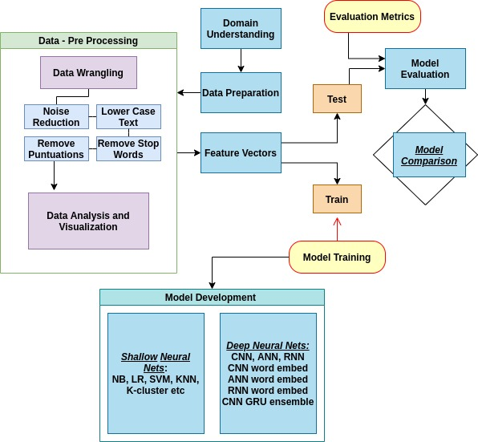

# Spam Email Classification | Adversarial Attacks-

##*1. A comparative study of Machine learning classifiers and deep neural network learning algorithms applied to the problem of Spam emails*##

##*2. Exploration of Adversarial attacks on spam email classification learning algorithms*##

**The Methodology/Pipeline of the system is illustrated below :**

* Data Preprocessing
* Model Training
* Model Testing and Evaluation

