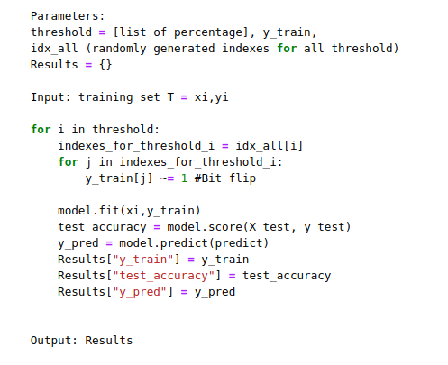
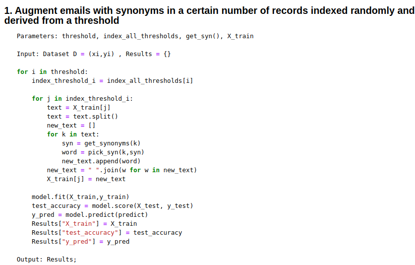
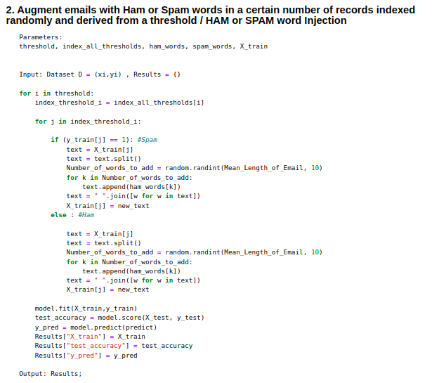
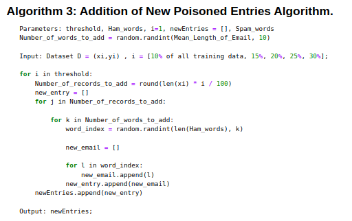
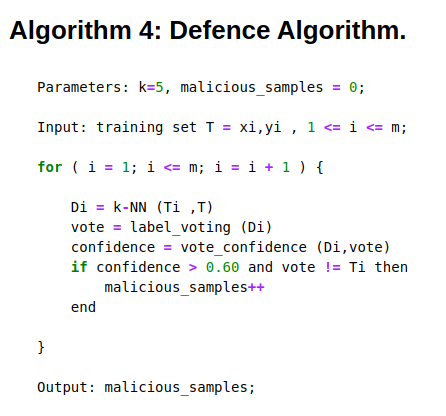

# Spam Email Classification | Adversarial Attacks-

## *1. A comparative study of Machine learning classifiers and deep neural network learning algorithms applied to the problem of Spam emails* ##

## *2. Exploration of Adversarial attacks on spam email classification learning algorithms* ##

**The Methodology/Pipeline of the system is illustrated below :**

* Data Preprocessing
* Model Training
* Model Testing and Evaluation

### Machine Learning Classifiers :
1. Multinomial Naive Bayes
2. Logistic Regression
3. Support Vector Machines ( linear and Radial basis function )
4. K-Nearest Neighbours
5. K-means Clustering
6. Random Forest 
7. Gradient Boosting 
8. XGBoost 
9. Decision Tree 

### Deep Learning Algorithms : 
1. DNN ( with word Embeddings )
2. RNN ( with word Embeddings )
3. CNN ( with word Embeddings )

4. DNN ( with word Pretrained Glove Embeddings )
5. RNN ( with word Pretrained Glove Embeddings )
6. CNN ( with word Pretrained Glove Embeddings )

### Feature Extraction techniques for Machine Learning Classifiers  : 
**tf-idf -> Term Frequency , Inverse Term Frequency**

---

### Feature Extraction techniques for Deep Learning Classifiers     : 
**Word Embeddings ( Trainable ) and ( Non - Trainable : glove )** 

---

### Metrics for Evaluation : 
1. **Accuracy**
2. **f1-Score**
3. **Precision**
4. **Recall**
5. **ROC-AUC**
6. **Error and Loss**

---

# Adversarial Attacks - 
1. **Label Flipping**

---

2. **Sample Poisoning (Synonym Replacement, Spam / Ham word Injection**

---

### Algorithm 2-1 : Synonym Replacement : 

### Algorithm 2-2 : Spam / Ham word Injection :

---

### Algorithm 3 : Addition of new Poisoned Emails algorithm (To do):

---

# Adversarial Attacks on Deep Learning Models (To do):
1. **Fast Gradient Method (FGM)**

---

2. **Fast Gradient Sign Method (FGSM)**

---

3. **L2 Projected Gradient Descent (PGD)**

---

4. **Linf Projected Gradient Descent (LinfPGD)**

---

# Adversarial attacks defensive mechanism (To do):

1. **Application of KNN as Defence**

---

